# PROG 01: Crunch Time

Briefly describe your app here.

## Authors

Jiachen Hu ([jc-hu@berkeley.edu](mailto:jc-hu@berkeley.edu))

## Demo Video

See [Ca] (https://youtu.be/tfTLxDrZ6FQ)

## Screenshots

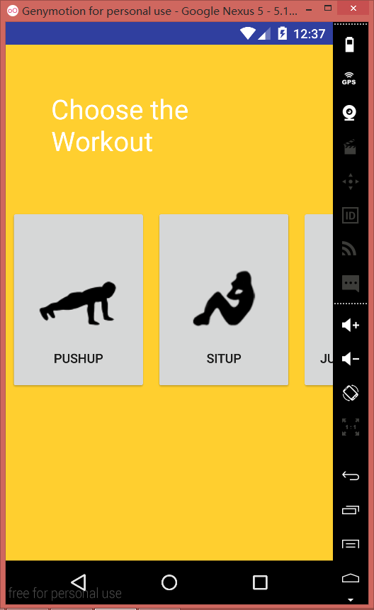
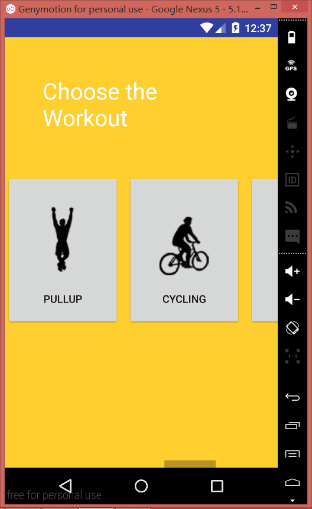
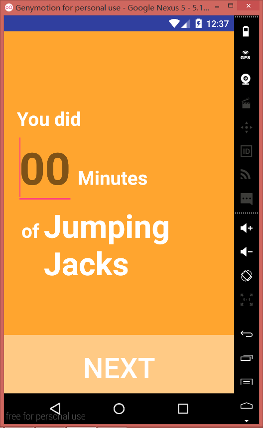
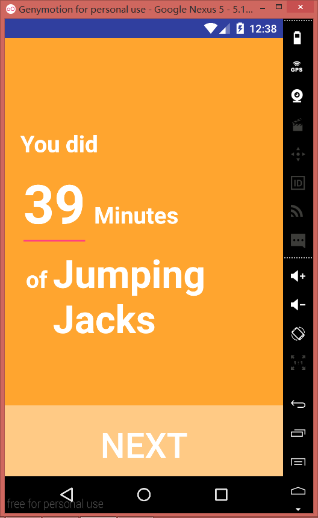
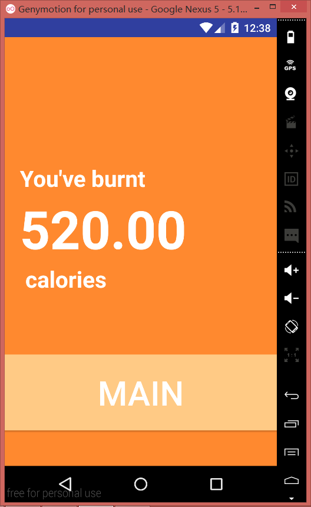
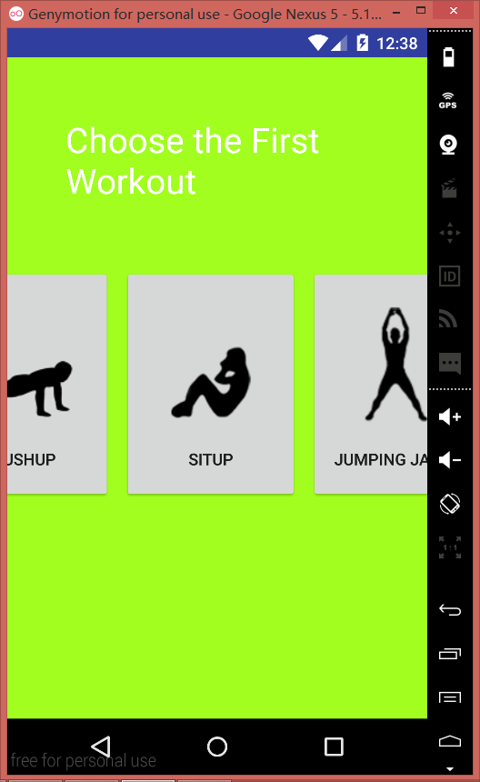
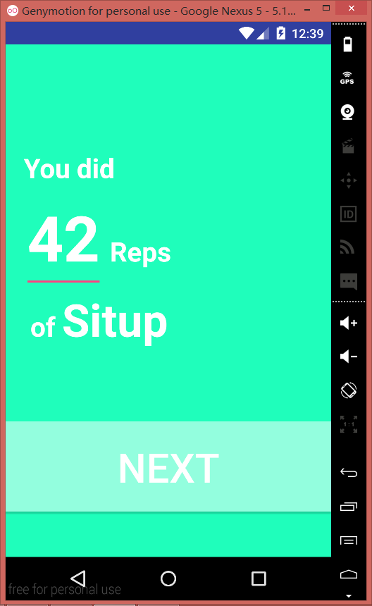
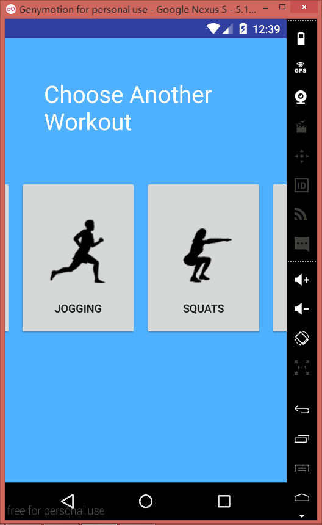
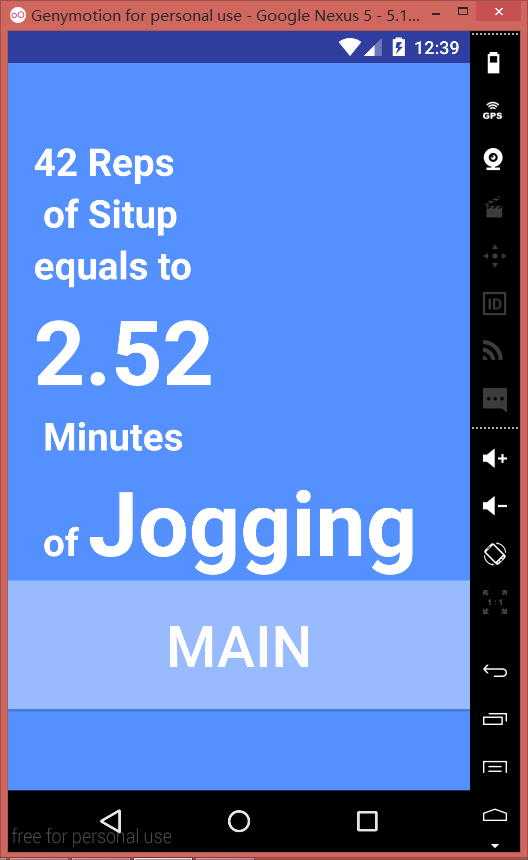
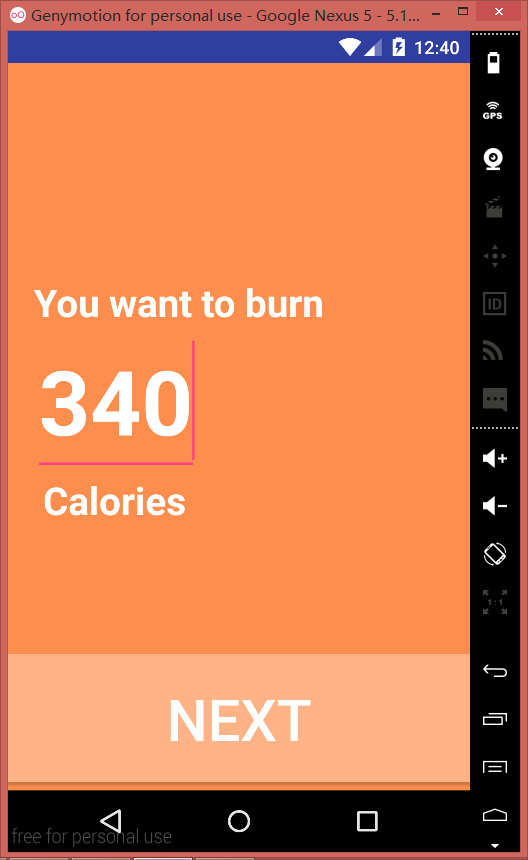
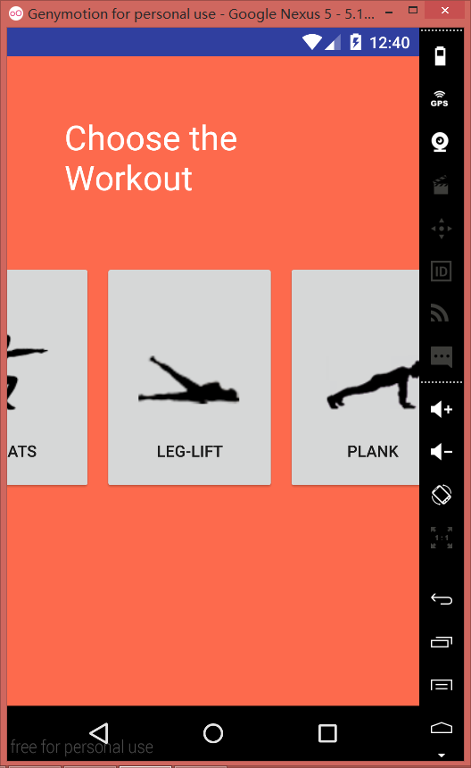
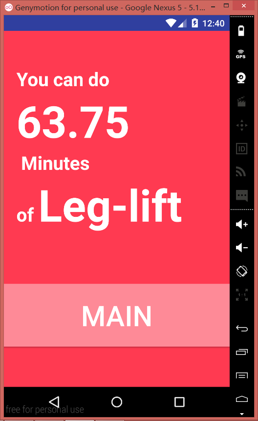
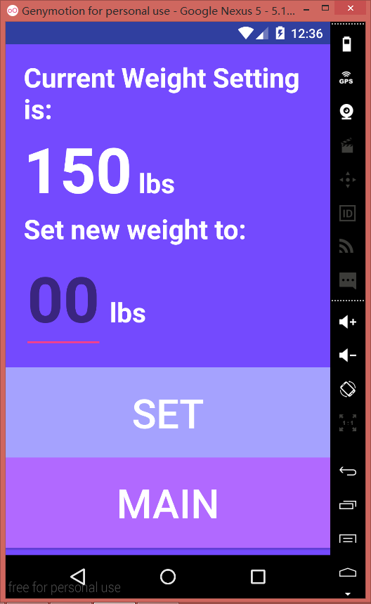
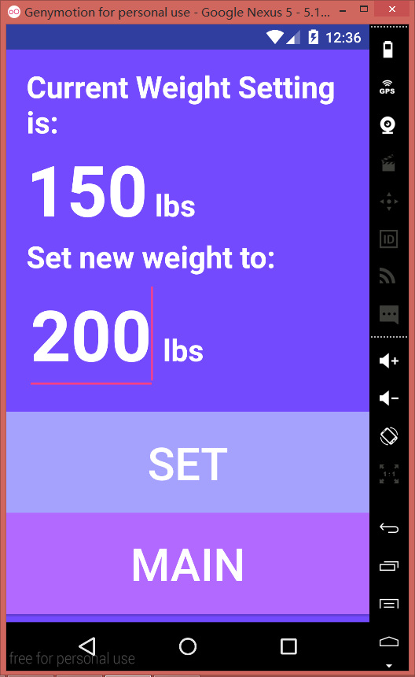
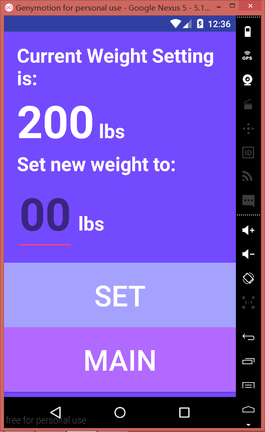

## Acknowledgments

* Hat tip to anyone who's code was used
* Any other support

*Feel free to enhance your README. For Markdown syntax, see [the GitHub Guides](https://guides.github.com/features/mastering-markdown/). Remove this line in your submission.*
